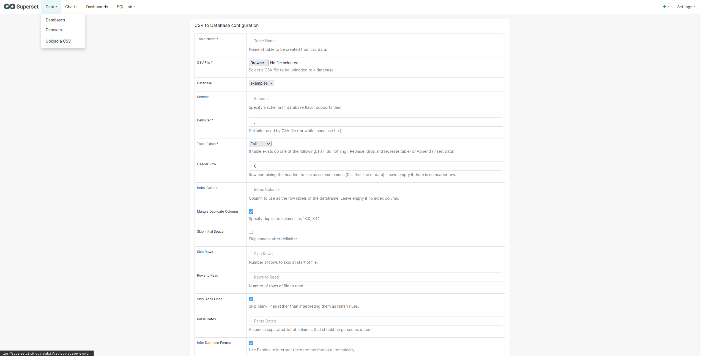
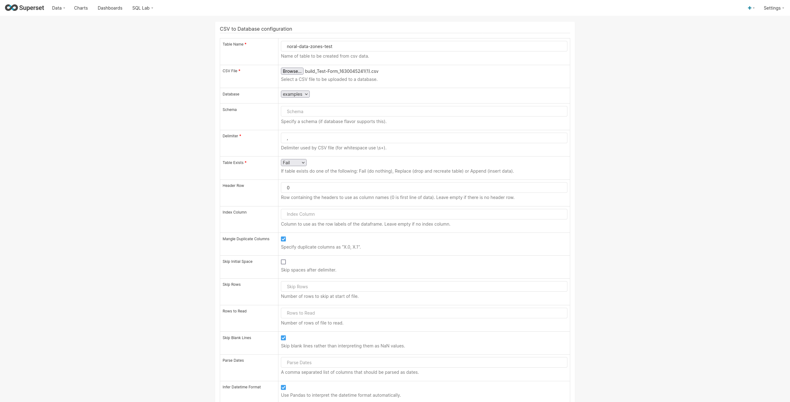
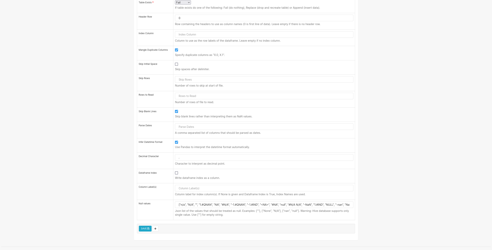
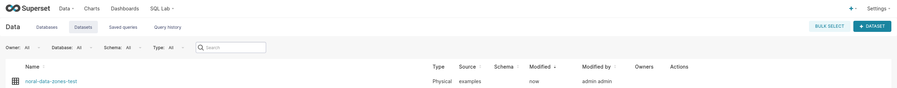
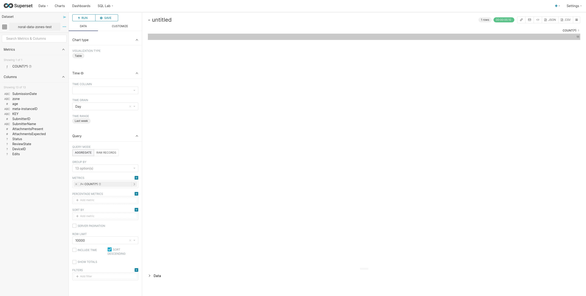
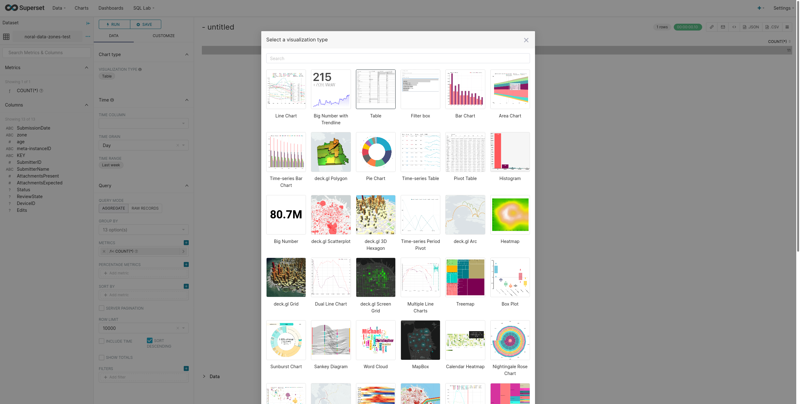
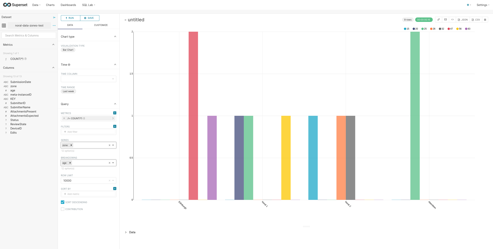
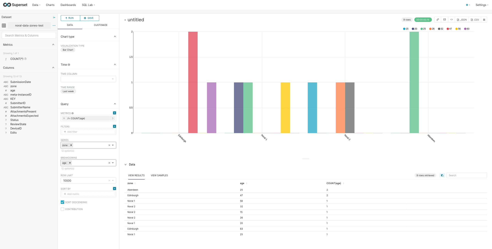
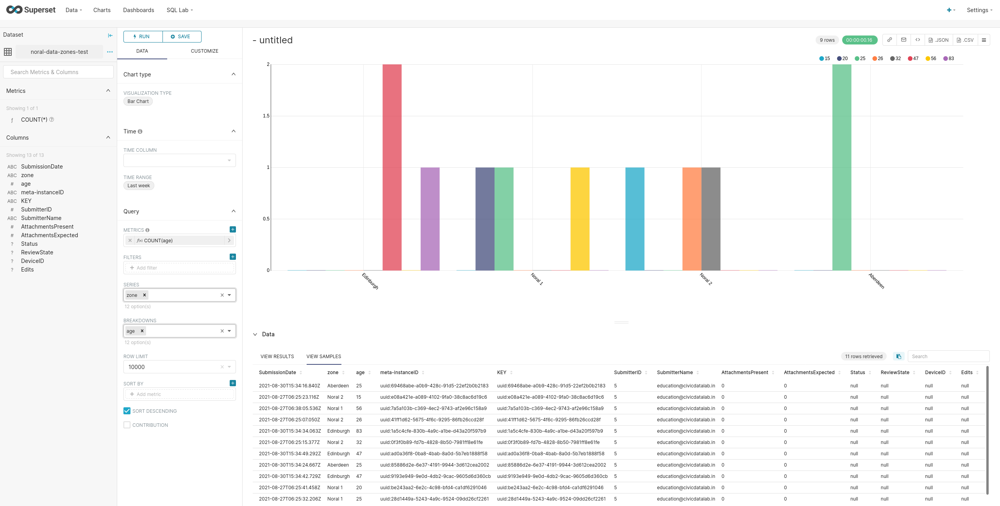
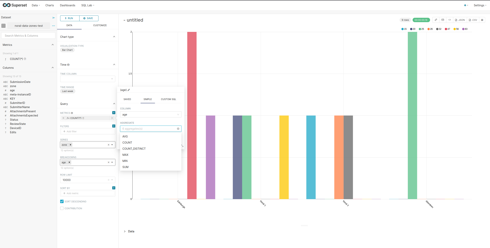

# Apache Superset

URL: https://superset.apache.org/
Live instance: https://supersetv2.civicdatalab.in

## Why Superset?

- Free and open source software
- Built with popular tech stack (Python3, Flask, Celery, React)
- Supports a lot of data visualizations
- Has granular access control list (database/schema/table)
- Supports wide range of integrations (like Slack etc.)
- Integration with major authentication backends (db, OpenID, LDAP, OAuth. etc.)

## How to use data collected from ODK on Superset?

1. Download form submissions as a CSV file from ODK. A guide on how to do it can be found [here](https://github.com/The-Data-for-Children-Collaborative/noral-tech-research/blob/main/datacollection/007-tool-1.md#how-to-work-with-odk).

2. Log into [Superset](https://supersetv2.civicdatalab.in).

3. From the Data dropdown menu on the top navigation bar, select "Upload a CSV".
   

4. Upload the CSV file downloaded in step 1 and give the table a name. Select the database to which this table has to be added.

5. Click Save on the bottom of the upload page.

6. After the CSV is saved as a dataset, it can be found in the list of datasets.

7. Click on the dataset name to open it.

8. Select your desired type of chart (visualization).
Note: Based on the type and content of the dataset, the supported chart types change. For example, if there is no time related information in a dataset, you cannot use time based charts to visualize it.

9. You can use the information present in the dataset to run multiple sets of SQL queries.

10. The metrics can be changed anytime from the UI by using the default metrics picker. Or you can write your own custom SQL queries.

11. You can save these visualizations and export them as CSV, JSON files as well as in image formats.

12. You can also create custom dashboards to showcase these visualizations.