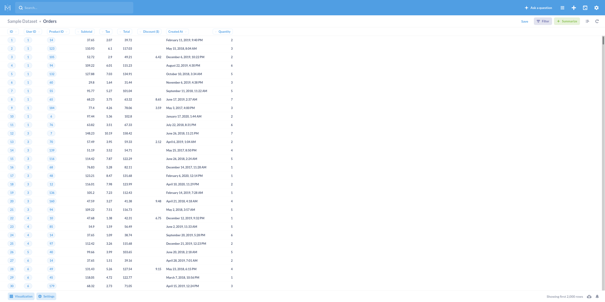

# Metabase

URL: https://www.metabase.com
Live instance: https://metabase.civicdatalab.in

## Why Metabase?

- Open source and self-hostable software
- More user friendly than Superset
- Simplified process of asking questions and gaining insights
- Supports wide range of SQL databases out of the box

## How to use Metabase?

1. Login to the live Metabase instance.

2. On the user dashboard you can see the list of databases that are connected to Metabase.
   

3. Select one of them (Sample dataset in this case). Now you can see all the tables that the Sample dataset contains and you may select the table that you want to visualize.

4. Now you can see all the tables that the Sample dataset contains and you may select the table that you want to visualize.

5. Click Summarize on the top left corner. A menu opens up on the right side that lets you select a metric and the attributes that you want to use to generate the visualization.

6. You may add multiple metrics and select multiple attributes. The type of visualization changes automatically based on the metrics you select. You can see it changed from a choropleth to a bard chart when another metric is added.

7. You can also switch to table view at any time, save the visualization and add it to a dashboard.

8. You can create custom dashboards to showcase these visualizations.