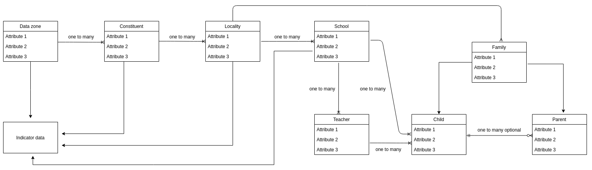

# Data flow from Data Collection to Central Datastore

**Aim**
To establish the flow of data from [the data collection tool](./006-odk.md) we identified to the central datastore that has the data model we proposed [here](../information-mapping/001-data-model.md).

**Suggested procedure**
1. While building a form for data collection on ODKBuild, specificy the entity for which the data is to be collected.
2. Add input fields for the attributes required for an entity. Eg: When collecting data related to a school, add input fields for school name, address, zone, number of teachers and students etc.
3. Mark all these fields as required.
4. After received submissions, extract school level information from them and transfer the information to central datastore.
5. When data for all the entities reaches the datastore, further analysis and mapping can be done.
