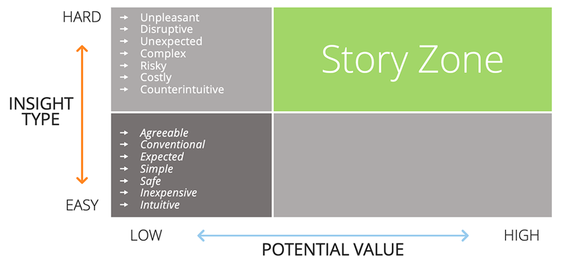

# Requirements for Data Stories

### What should a good data story have?

#### 1. Compelling insight

It is important to determine if an insight merits its own data story. An insight should not offer limited value to the audience. If it does, it's not worthy of a data story. An insight should ideally be "hard" for an audience to accept and embrace. Then the data story crafted for it will be more impactful.

Use the below matrix to evaluate an insight.

> Credits: *BRENT DYKES | Effective Data Storytelling: How To Drive Change With Data, Narrative, and Visuals (WILEY 2020)*

#### 2. Data

We must have the accurate and full data to support the insight. Do not graph a sample of data  that is too small to permit real, concrete conclusions.

#### 3. Strong narrative

Give voice to the data with a strong narrative. Treat each data point as a character in a story with their own story to tell that evoke emotional response.

#### 4. Interactive visualization(s)

Communicate the insight through visualizations that are interactive and make it easy to "see" the story.
