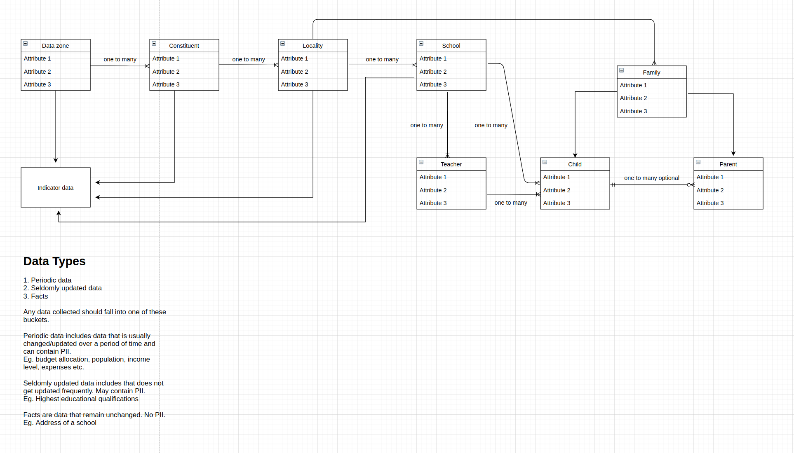

# Data Schema

Creating a hard and specific data schema for data collection at this stage of the project is not reliable because:

1. CDL team does not have access either sample or real data that was already collected.

2. NORAL team is also not fully aware of the data collection process.

## Suggested method

Find out the entitites from which data could be collected and map their relationships. The individual attributes of the entities may change once we get access to real data and start implementing the platform in phase 2 of the project.

## Suggested schema for data collection
