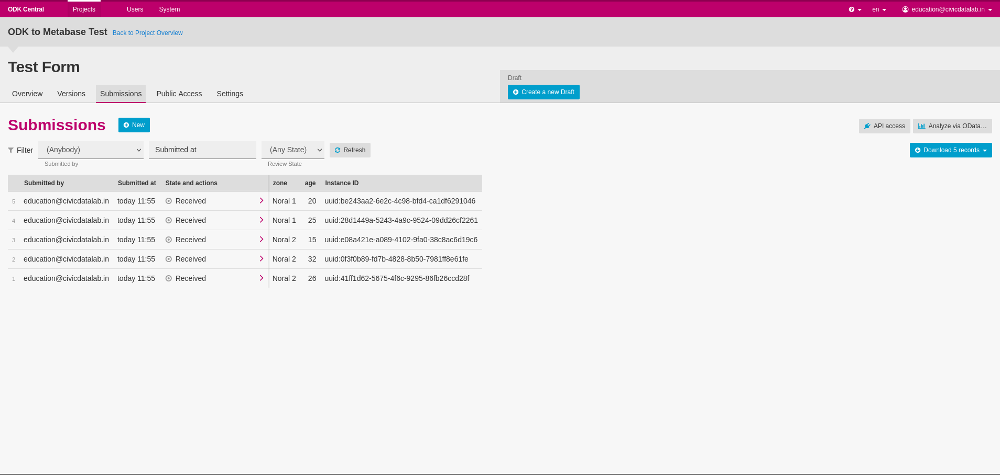

# Open Data Kit (ODK)
Website: https://getodk.org

## Why ODK?
- Open source software
- Has both mobile and web apps
- Supports collecting data offline
- Has very flexible forms
- Already used by millions (WHO, Red Cross, etc.)
- Can be self-hosted

## How to work with ODK
These are the steps involved in collecting data from ODK Central.
1. Build a form on [ODK Build](https://build.getodk.org) with all the required questionnaire. This requires creating a account on ODK Build.

2. Export the form to either XML or XLSForm formats.

3. Login to our self-hosted version of [ODK Central](https://noralodk.civicdays.in). Signing up on ODK Central is currently not enabled. Please let DC or me know if you need an account.
4. Create a project on ODK Central.
5. Open the project page and click on "New..." in the Forms section.

6. Upload the file exported in step 2. A form is created in draft state.

7. Complete the tasks in Draft Checklist and publish the draft.

8. Share the link of the form to surveyees and start collecting data.
9. Once the target submissions are received, you may download and save the records manually or transfer and interact with the data via OData APIs.
