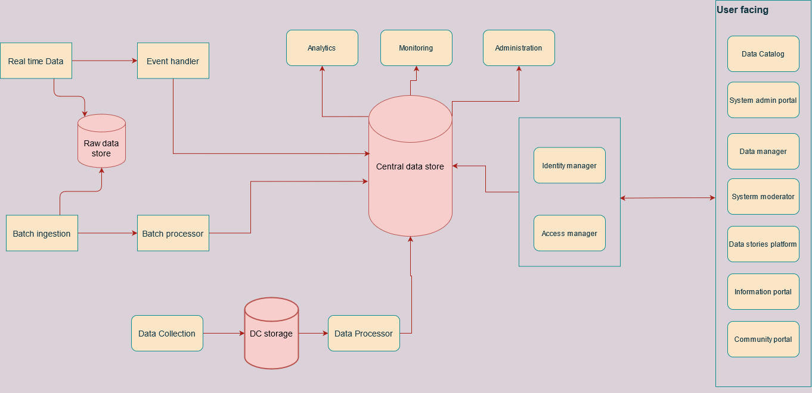
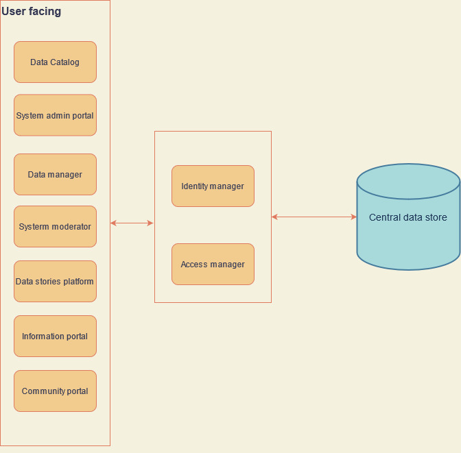
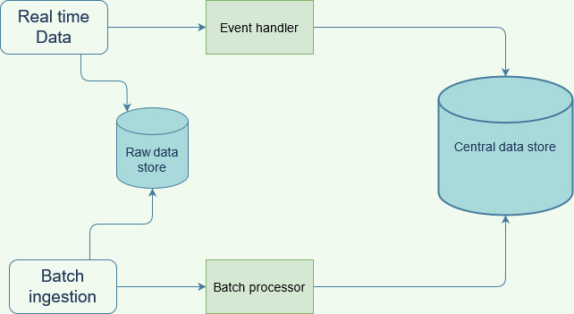
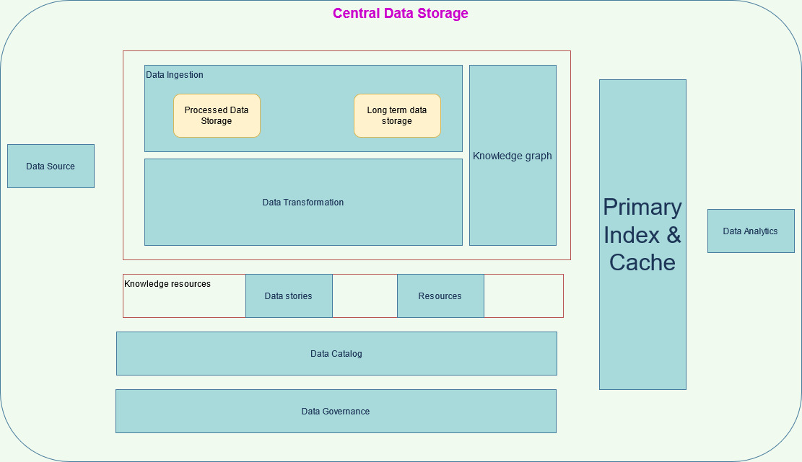

Following are the major components of the System

1. User facing portals
2. Data Sourcing
3. Data storage
4. Monitoring and Analysis

## User Facing Portals

This is the group of all systems which caters to userflows which are enduser facing. Following are some key identified systems:

- Data Catalog
- Storis and Blogs
- Community forum
- Information portal
- Data management platform
- Sytem moderation control panal

## Data Sourcing

The System would support sourcing of data from three different processes
1. Direct bulk upload by system maintainer
2. Data collected from primary data collection
3. Data periodically updated via automated processes

## Data Storage
The system contains various datastorage capabilities at different levels of the platform. Each component in the system would have a temporary storage to enable faster data access and processing. 

All datasets are stored pre and post procesing to enable higher reselience against dataloss. The central datastore manages the processing, idexing, caching and archival of data.

A knowledgegraph of all the base truths in the system is maintained to enable information mapping against mutiple datasources.

## Monitoring and Analysis
The system would be equipted with central monitoring system to monitor workflows between all the components of the system. This system would also allow mannual interventions and policy enforcements.

The processesed data is also avalilable to allow analysis of all the datasets present in the system.